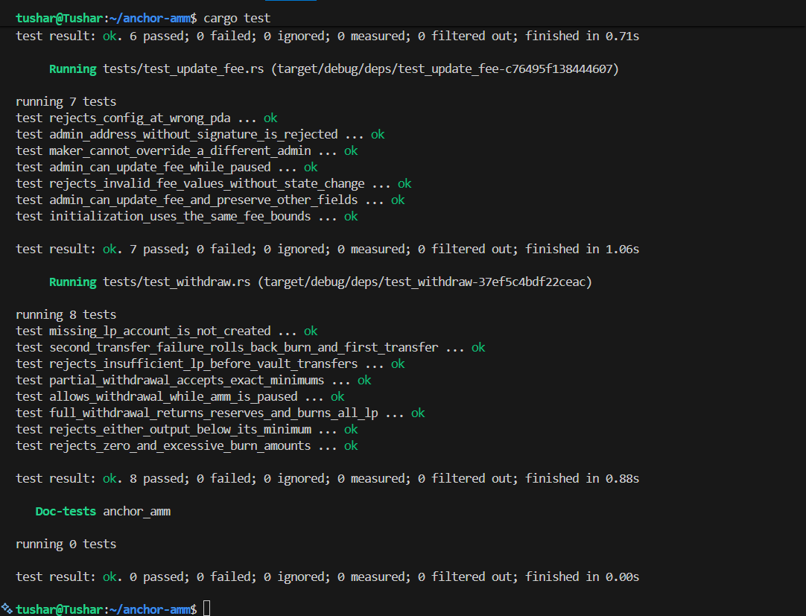

# Anchor AMM

A constant-product automated market maker for two SPL tokens on Solana, implemented with Anchor.

## How it works

Each pool holds two token reserves and issues LP tokens representing a share of both. Swaps use the constant-product formula, with fees retained in the pool for LP holders.

The first deposit mints `floor(sqrt(amount_a * amount_b))` LP units. Later deposits match the reserve ratio and mint LP tokens proportionally. Withdrawals burn LP tokens and return a share of each reserve.

Deposits, withdrawals, and swaps enforce user-provided minimum outputs. Fees are set in basis points: `100` means 1%.

## Instructions

- `initialize_amm` creates a configuration with an admin, fee, and pause state.
- `initialize_pool` creates a token pair's pool, vaults, and LP mint.
- `deposit_to_pool` deposits both tokens and mints LP tokens.
- `withdraw_from_pool` burns LP tokens and returns both tokens.
- `swap` exchanges one pool token for the other. `a_to_b = true` selects A to B; `false` selects B to A.
- `set_paused` pauses or resumes pool creation, deposits, and swaps. Withdrawals remain available.
- `update_fee` changes the fee for all pools under an AMM.
- `transfer_admin` transfers control with signatures from both the current and new admin.

The current admin must authorize all configuration updates. Pool mints use a fixed address order so each AMM has one pool per token pair.

## Run

Install Rust, the Solana CLI with SBF build tools, and the Anchor CLI, then run from the repository root:

```bash
anchor test --skip-deploy --skip-local-validator
```

This builds the program and its IDL, then runs the Rust integration tests with LiteSVM. No deployment or local validator is needed.

## Test results

The integration test suite passes successfully.

**Latest test run:**

- `test_update_fee.rs` — 7 passed
- `test_withdraw.rs` — 8 passed
- All shown tests completed with **0 failures**



## Scope

This is an educational implementation for the legacy SPL Token Program. It does not support Token-2022, oracle pricing, protocol fees, or minimum locked liquidity.

Pool creation and the first deposit are separate instructions. Submit them in one transaction to create and fund a pool together. Any tokens already donated to empty pool vaults become part of the first depositor's share.
